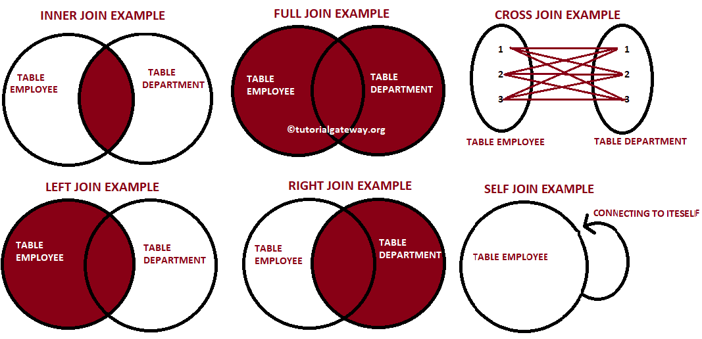

# Session – 2026-02-17

## Topics covered

During this session, we deep dive into multi-table queries and the various types of relationships established through JOIN clauses.

- Multi-table queries with JOINs (JOIN, INNER JOIN)
- OUTER JOINs (LEFT JOIN, RIGHT JOIN, FULL JOIN)
- CROSS JOIN, SELF JOIN

## What I understood
- INNER JOIN: Returns records that have matching values in both tables. It is like an intersection between two sets.

- AS (Alias): Temporary names given to tables or columns to make queries more readable and shorter.

- LEFT JOIN: Returns all records from the left table, plus the matched records from the right table. If there is no match, the right side results in NULL.

- RIGHT JOIN: Returns all records from the right table, plus the matched records from the left table.

- FULL JOIN: Returns all records when there is a match in either the left or right table. It’s a complete union of both datasets.

- CROSS JOIN: Produces a Cartesian product; every row from the first table is paired with every row from the second table.

- SELF JOIN: A regular join, but the table is joined with itself (useful for hierarchical data like Employee/Manager lists).

## What is still confusing
- The usage of LEFT JOIN and RIGHT JOIN to filter data from one or more table.

## Questions
- How can I identify which table is "LEFT" or "RIGHT"?
## Related concepts
- [Concept name](../concepts/concept-name.md)

## Resources used
- See `resources/`