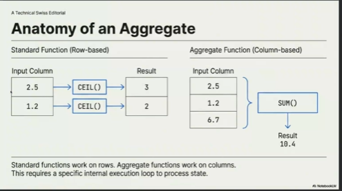
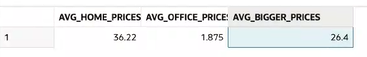

# Session – 2026-02-24

## Topics covered

During this session, we went beyond simple lists and learned how to use Aggregate Functions to summarize data. This is how we get big-picture info—like finding the total number of roles in a building or identifying which studio has the highest number of employees—without looking at every row one by one.

- Mathematical Aggregation: Using functions like AVG, SUM, MAX, and MIN to turn a long column of numbers into a single, useful value like an average or a total.

- Data Counting: Using COUNT(*) to quickly see how many records exist in a specific table or filtered result.

- Advanced Filtering with HAVING: Learning how to filter grouped data using the HAVING clause, which is necessary because the WHERE clause can't be used directly on aggregated results.

## What I understood
- Aggregate expressions are tools that let us summarize a group of rows. Instead of seeing every individual entry, they give us a "total" view of the data.

- AVG(column_name) is what we use to find the mean. It's great for things like finding the average price of items or the average age of a group.

- SUM(column_name) is for math where we need a grand total. It adds every value in the column together.

- MAX and MIN are like "high-low" markers. MAX finds the largest value (like the highest salary), and MIN finds the smallest (like the lowest price).

- COUNT(*) is a simple way to count rows. It doesn't care what's in the rows; it just tells you how many there are.

- The HAVING expression is a special filter. Since SQL processes the WHERE clause before it does the math for aggregates, we use HAVING to filter the results after the math is done. For example, if I want to see only departments where the average salary is over 50,000, I have to use HAVING.




## Examples

```sql CREATE TABLE products (

 id NUMBER GENERATED BY DEFAULT AS IDENTITY PRIMARY KEY,

 name VARCHAR2(255) NOT NULL,

 price NUMBER(10,2) NOT NULL

);
```
-- insert
```sql 
INSERT INTO products (name, price) VALUES ('pen', 2.50);

INSERT INTO products (name, price) VALUES ('paper', 1.25);

INSERT INTO products (name, price) VALUES ('hammer', 6.76);

INSERT INTO products (name, price) VALUES ('blanket', 12.45);

INSERT INTO products (name, price) VALUES ('chair', 59.99);

```

```sql 
SELECT avg(price) FROM products;

``` 
```sql 
DROP TABLE products CASCADE CONSTRAINTS;
```

```sql 
CREATE TABLE products (

 id NUMBER GENERATED BY DEFAULT AS IDENTITY PRIMARY KEY,

 name VARCHAR2(255) NOT NULL,

 price NUMBER(10,2) NOT NULL,

 category VARCHAR2(255)

);
```
```sql 
SELECT avg(price), category from PRODUCTS where price > 5 GROUP BY category;
```

```sql 

INSERT INTO products (name, price, category) VALUES ('pen', 2.50, 'office');

INSERT INTO products (name, price, category) VALUES ('paper', 1.25, 'office');

INSERT INTO products (name, price, category) VALUES ('hammer', 6.76, 'tools');

INSERT INTO products (name, price, category) VALUES ('blanket', 12.45, 'home');

INSERT INTO products (name, price, category) VALUES ('chair', 59.99, 'home');
```

-- where
```sql 
SELECT avg(price), category FROM products WHERE avg(price) > 2.0 GROUP BY category;
```

```sql 
SELECT 

    AVG(CASE 

    WHEN category = 'home' THEN price 

    END) AS avg_home_prices, AVG(CASE 

    WHEN category = 'office' THEN price 

    END) AS avg_office_prices

FROM products;
```




## What is still confusing
- No concepts from this session are confusing. Everything was clear.

## Questions
- Why is it possible to filter standard columns with HAVING?

## Related concepts
- [Concept name](../concepts/concept-name.md)

## Resources used
- See `resources/`
