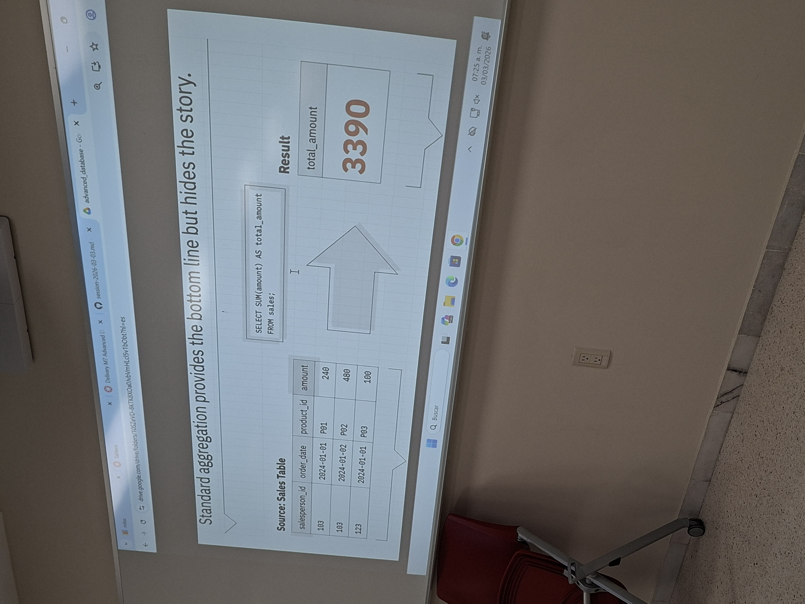
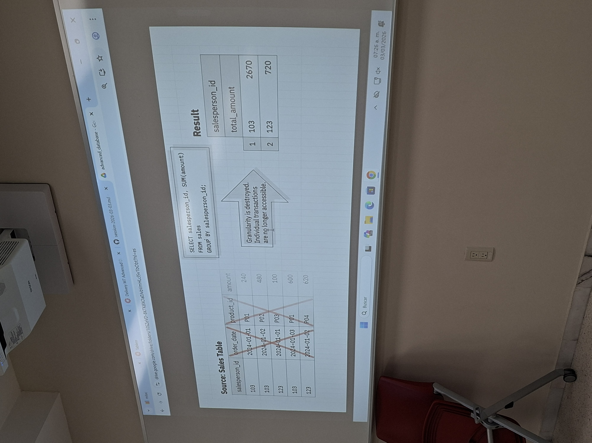
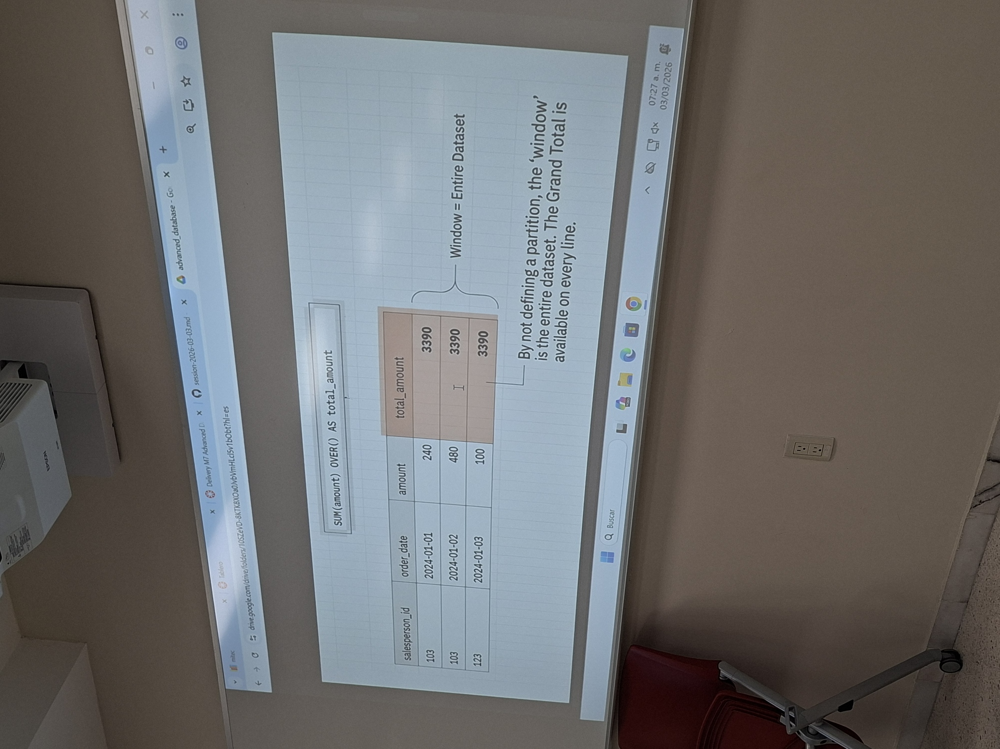
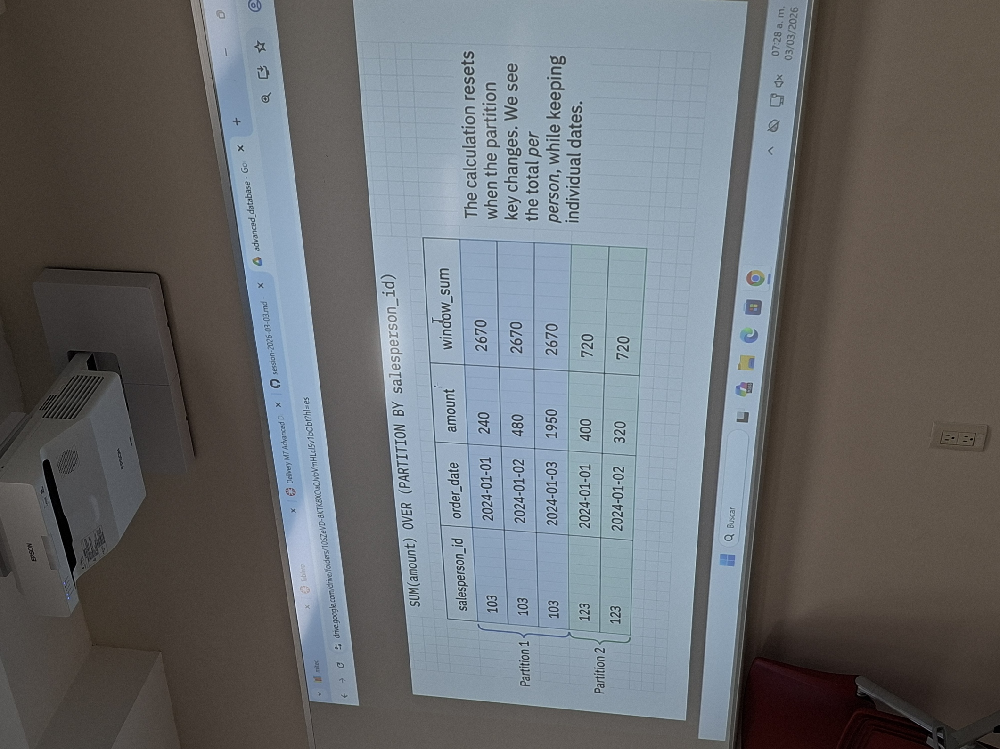
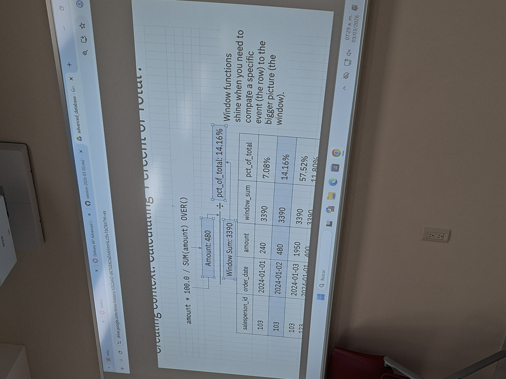
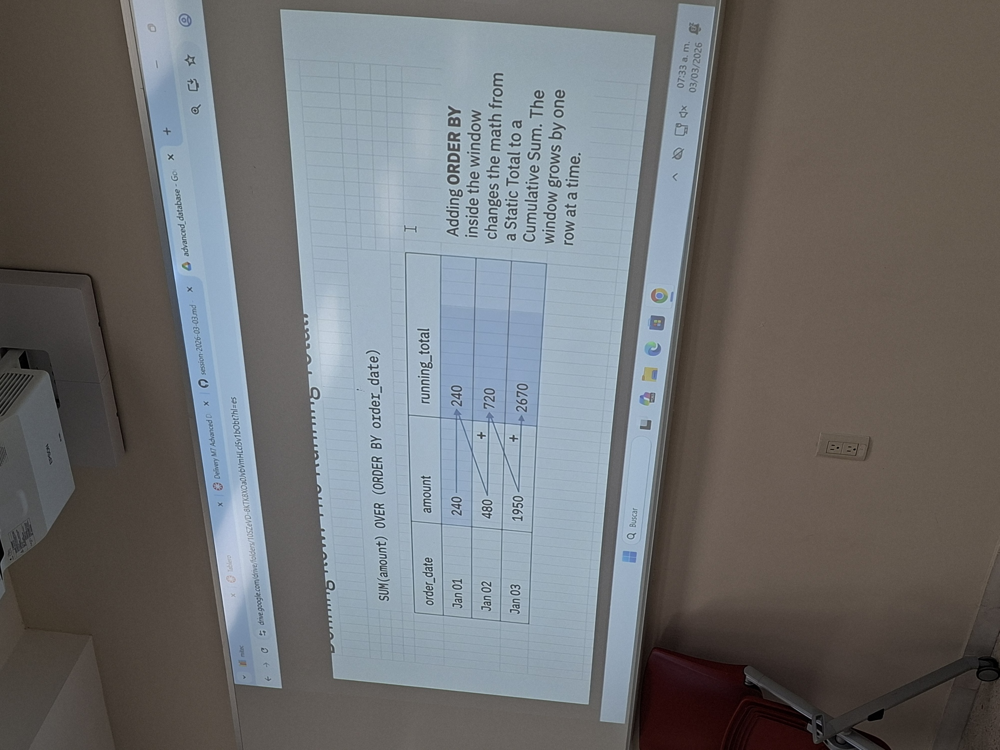
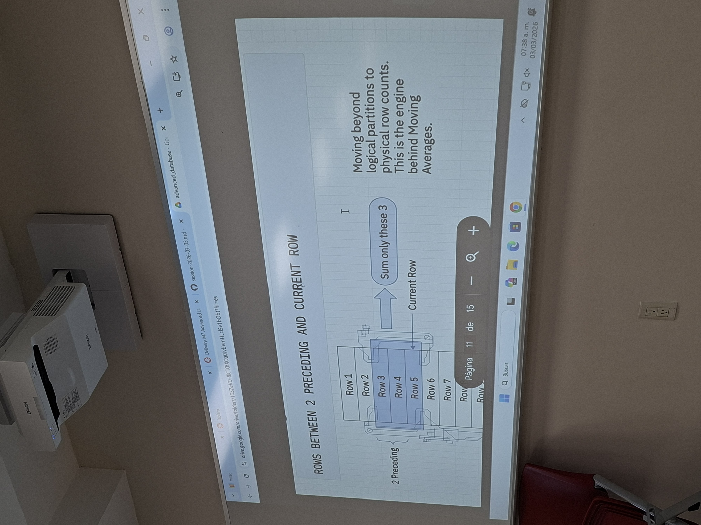
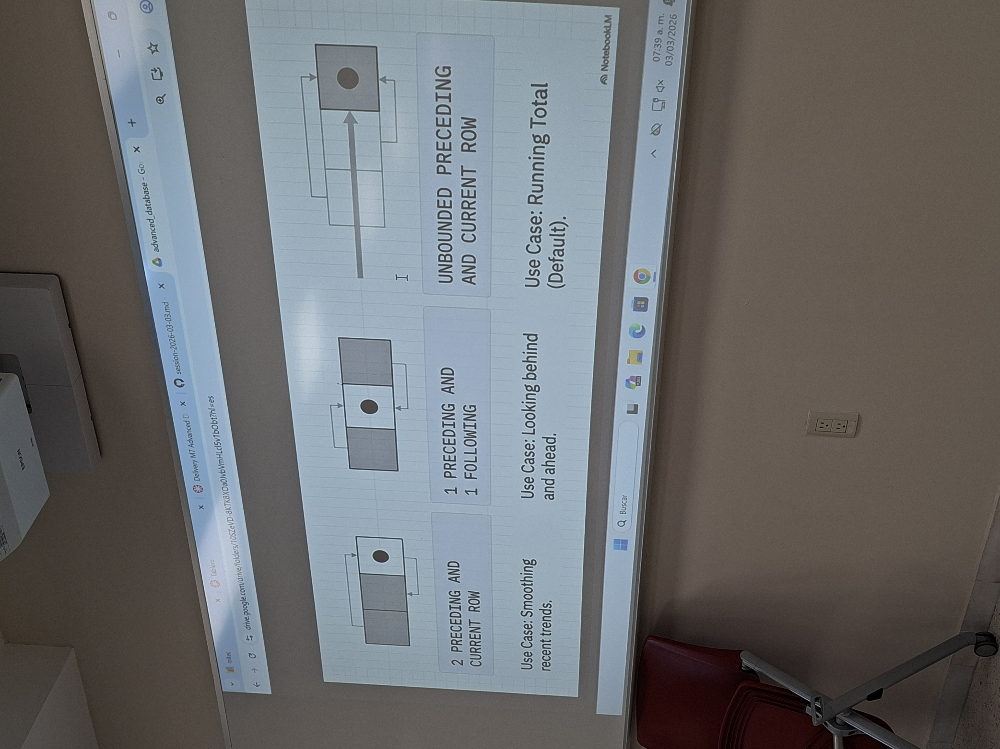

# Session – 2026-03-03

## Topics covered
During this session, we explored Window Functions (also known as Analytic Functions). Unlike aggregate functions that collapse rows into a single result, these allow us to perform complex calculations across a set of rows while still keeping the individual row detail visible.

- Window Definition with OVER: Learning how to use the OVER() clause to define exactly which "window" of data a function should look at.

- Data Partitioning and Sorting: Using PARTITION BY to group data similarly to a GROUP BY, and ORDER BY to define the sequence within those groups.

- Ranking and Numbering: Implementing functions like ROW_NUMBER(), RANK(), and DENSE_RANK() to create ordered lists and handle ties in data.

- Cumulative Calculations: Practicing how to create running totals (cumulative sums) by combining aggregate functions with the OVER(ORDER BY...) syntax.

- Windowing Frames (ROWS/RANGE): Learning how to use the "Windowing Clause" to define specific boundaries for a calculation, such as using BETWEEN UNBOUNDED PRECEDING AND CURRENT ROW to control exactly which rows are included as the window moves.

## What I understood
- Analytic Functions vs. Aggregates: The main difference is that analytic functions return a value for every row in the result set, rather than just one value for the whole group.

- The OVER() Clause: This is the heart of the window function. If left empty, it treats the whole table as one window.

- PARTITION BY: Acts like a GROUP BY but inside the window, separating data into logical chunks (e.g., grouping by Department).

- ORDER BY: Sets the order for the calculation, which is essential for things like rankings or running totals.

- Cumulative Sums: I learned that using SUM() OVER (ORDER BY...) makes the "window" grow by one row at a time, allowing us to calculate a running total as we move down the list.

- Ranking Functions: * ROW_NUMBER() gives every row a unique number.

- RANK() leaves gaps if there is a tie (e.g., 1, 2, 2, 4).

- DENSE_RANK() does not leave gaps (e.g., 1, 2, 2, 3).

- Windowing Frames: I learned to use ROWS BETWEEN UNBOUNDED PRECEDING AND CURRENT ROW to define a "sliding window." This is what allows a SUM() to become a Running Total, as it includes all previous rows plus the current one.

### ------------------------ Structure -----------------------
```sql
SELECT column_name1, 
       window_function(column_name2) 
       OVER ([PARTITION BY column_name3] [ORDER BY column_name4]) AS new_column
FROM table_name;
```

- window_function: Aggregate or ranking function (SUM(), AVG(), ROW_NUMBER(), etc.)
- column_name1: Column(s) to display
- column_name2: Column used by the window function
- column_name3: Column for grouping (PARTITION BY)
- column_name4: Column for ordering (ORDER BY)
- new_column: Alias for the window function result
- table_name: Table to select data from

### Example:
```sql
SELECT Name, Age, Department, Salary, 
       AVG(Salary) OVER( PARTITION BY Department) AS Avg_Salary
FROM employee
```
### Images:









## What is still confusing
- The syntax regarding which column is actually being affected by the function. Sometimes it's confusing to distinguish between the column used for the calculation, the column used for the partition, and the column used for the ordering within the same statement.

## Questions
- In a complex window function, is there a visual or logical rule to quickly distinguish the "target" column (the one being calculated) from the "frame" columns (the ones used in PARTITION or ORDER BY) to avoid syntax errors?
- When using ROWS BETWEEN UNBOUNDED PRECEDING AND CURRENT ROW, if I don't specify an ORDER BY, how does SQL decide which row is the "first" one to start the calculation?

## Related concepts
- [Concept name](../concepts/concept-name.md)

## Resources used
- See `resources/`