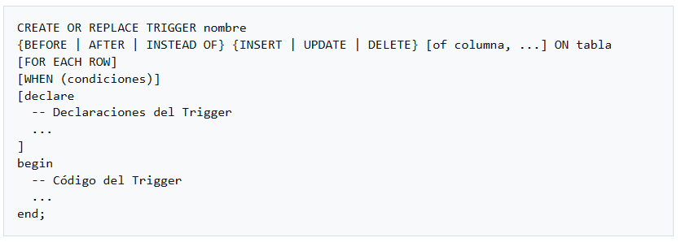
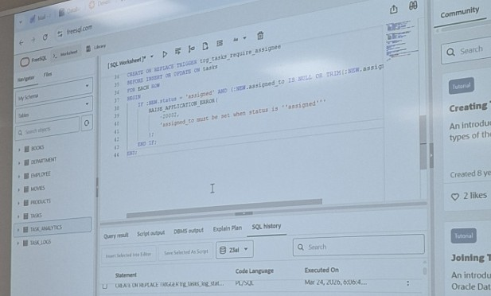
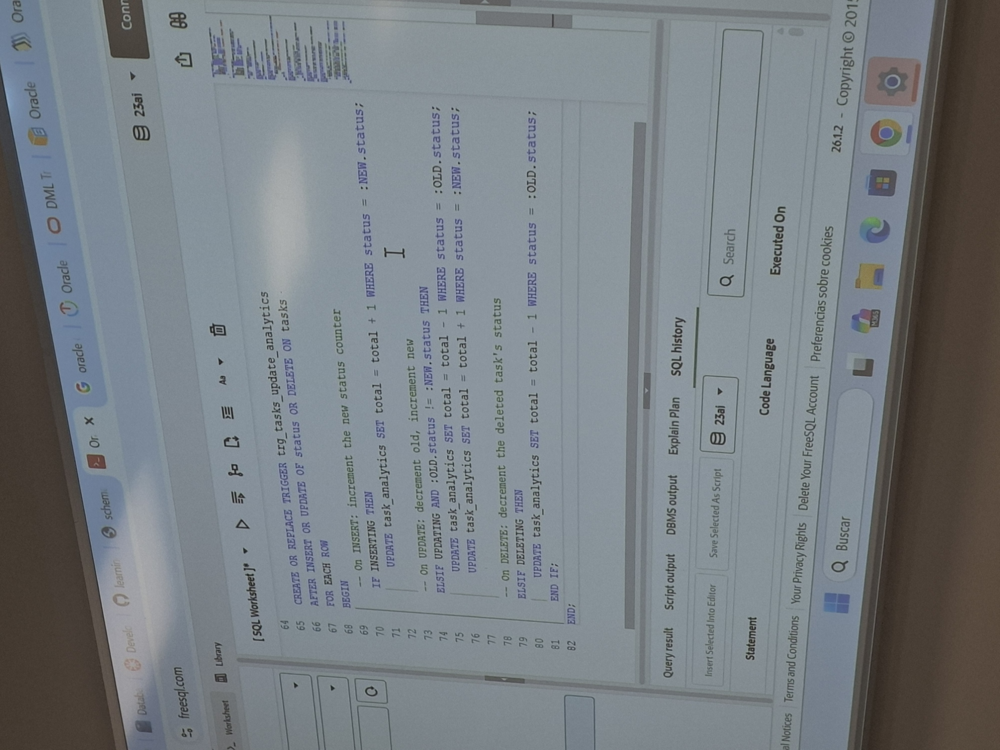

# Session – 2026-03-24

## Topics covered
During this session, we explored Database Triggers, which are automated scripts that act as "event listeners" within the database. Unlike standard procedures that you must call manually, these are "fired" by the system itself whenever data is modified.

- **Trigger Definition:** Understanding that a trigger is a specialized stored procedure tied directly to a table or view, designed to maintain data integrity or automate auditing.
- **BEFORE/AFTER:** Learning how to control exactly when the logic executes—either to validate data before it is saved or to log changes after they are finalized.
- **DML Event Mapping:** Identifying which database actions—INSERT, UPDATE, or DELETE—should trigger the code to run.
- **Contextual Records (:old and :new):** Using pseudo-records to access the data values exactly as they were before the change and exactly as they are proposed to be after the change.

## What I understood
- I understood that triggers are powerful because they work behind the scenes. You don't "run" a trigger; you simply change data, and the trigger handles the consequences automatically.
- I learned that BEFORE triggers execute validation or data modification before a record is saved, allowing changes to :new values, while AFTER triggers run after data is saved, used for auditing or updating other tables.
- **Record Transitions:**
    - INSERT operations only provide access to :new values.
    - DELETE operations only provide access to :old values.
    - UPDATE operations provide access to both, enabling a direct comparison between the previous and new data states.

### Syntaxis



- {BEFORE | AFTER}: Defines the timing relative to the DML event.

- {INSERT | UPDATE | DELETE}: Defines the event that activates the trigger.

- FOR EACH ROW: Optional; ensures the trigger fires for every single affected row.

- WHEN: Optional; adds a logical filter so the trigger body only runs if the condition is true.

- BEGIN/END: The block where the PL/SQL logic is defined.




### :old and :new Rows
These records contain the values before and after the operation.

In BEFORE-type triggers, the values of :new can be modified.

### Disabling and Enabling Triggers
```sql
ALTER TRIGGER <trigger_name> DISABLE;
ALTER TRIGGER <trigger_name> ENABLE;
```
### Mutating Table Error
When querying a table in a FOR EACH ROW trigger that is being affected by the operation that fired the trigger, the following error occurs:

```sql
ORA-04091: table <owner>.<table_name> is mutating, trigger/function may not see it
```

## What is still confusing
- It is still confusing to assimilate the logic of the trigger execution inside the BEGIN...END block to handle multiple DML events in one place logic before or after the data is stored, and how to handle errors. Additionally, it is kind of hard to remember the syntax order, and how it works each statement when moving from simple triggers to more complex logic.

## Questions
- No questions.

## Related concepts
- [Concept name](../concepts/concepts-2026-03-24.md)

## Resources used
- See `resources/`
