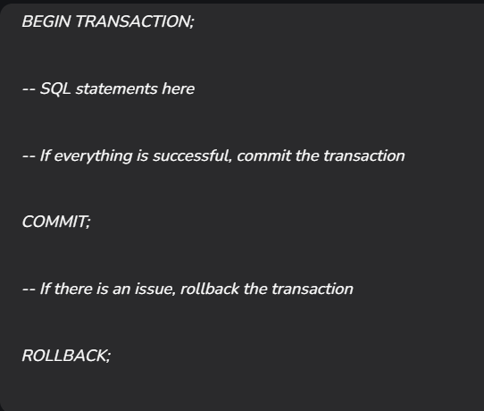

# Session – 2026-04-21

## Topics covered
During this session, we explored the logic of Transactions and their implementation within stored procedures. We focused on how databases handle multiple operations as a single unit of work to ensure data integrity.

- **Database Transactions:** Learning how to group multiple SQL statements so they succeed or fail as a single block using BEGIN, COMMIT, and ROLLBACK.
- **ACID Properties:** Analyzing the four core requirements (Atomicity, Consistency, Isolation, Durability) that guarantee reliable database transactions.
- **Stored Procedures:** Understanding how to encapsulate complex logic into a reusable, named object that can be executed with specific parameters.
- **Autocommit:** Differentiating between the mode where every SQL statement is committed instantly and the mode where the user manually controls the transaction boundary.


## What I understood
- I learned that a transaction treats a series of steps as one. If any part of the process fails (like the divide-by-zero example in the EXISTS clause), the entire transaction can be undone to prevent leaving the database in a "half-finished" state.
- Using BEGIN TRANSACTION and COMMIT, I can ensure that related updates—like moving a balance between accounts or promoting a user based on post scores—happen simultaneously or not at all.
- I understood that Stored Procedures allow us to save complex logic (like the user promotion query) on the server. This makes the code reusable and easier to maintain since I only need to call EXEC procedure_name instead of rewriting the logic.
- **ACID in Practice:**
    - **Atomicity:** The "All or Nothing" rule.
    - **Consistency:** Ensuring data moves from one valid state to another, following all rules and constraints.
    - **Isolation:** Keeping transactions separate so they don't see each other's "mess" while they are still running.
    - **Durability:** Guaranteeing that once a COMMIT happens, the data is saved permanently, even if the power goes out.

### Example

```sql
UPDATE accounts SET balance = balance - 500 WHERE account_id = 1;
```
```sql
BEGIN TRANSACTION
    DECLARE
        @UserToPromote integer = NULL;
    
    SELECT TOP (1)
        @UserToPromote = u.Id
    FROM dbo.Users AS u
    WHERE u.Reputation = 1
    AND   EXISTS
    (
        SELECT
            1/0
        FROM dbo.Posts AS p
        WHERE p.OwnerUserId = u.Id
        AND   p.PostTypeId = 1
        AND   p.Score = 0
    )
    ORDER BY
        u.CreationDate,
        u.Id;
    
    /*IRL you might bail here if this is NULL or something*/
    
    WITH
        UserToPromote
    AS
    (
        SELECT TOP (1)
            p.*
        FROM dbo.Posts AS p
        WHERE p.OwnerUserId = @UserToPromote
        AND   p.PostTypeId = 1
        AND   p.Score = 0
        ORDER BY
            p.Score,
            p.CreationDate
    )
    UPDATE utp
        SET utp.Score += 1
    FROM UserToPromote AS utp;
COMMIT TRANSACTION;
```
- Procedure -> exec name_procedure (value)

## What is still confusing
- It is still confusing how the database manages "Isolation" when two different users are trying to update the same record at the exact same time.

## Questions
- Does keeping a transaction open for a long time (e.g., while waiting for a user to click "OK") lock the tables and prevent other people from working?
- When should I use a Stored Procedure instead of a Function if I need to perform an UPDATE operation?

## Related concepts
- [Concept name](../concepts/concept-name.md)

## Resources used
- See `resources/`
