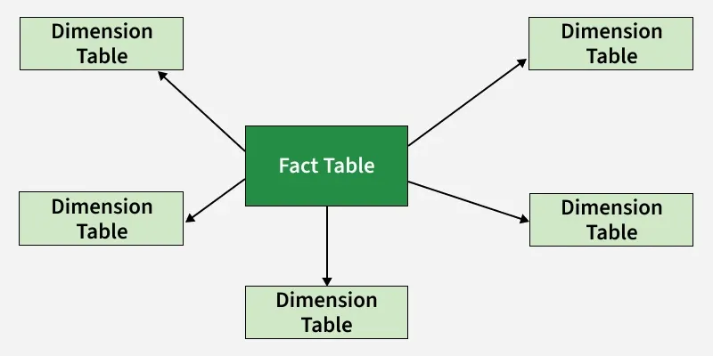
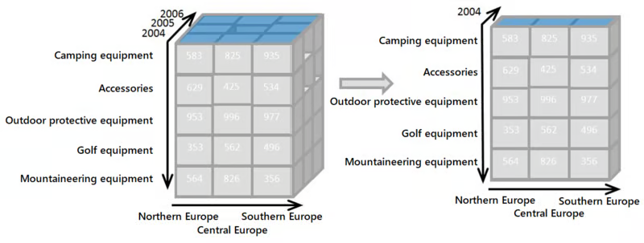
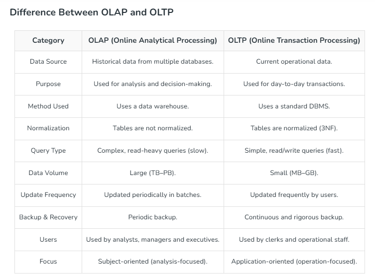
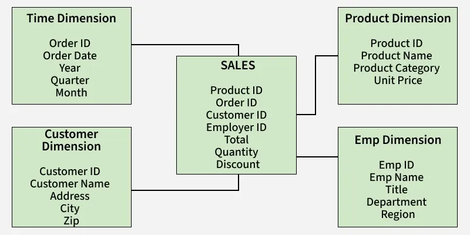

# Session – 2026-05-26

## Topics covered
- **OLTP (Online Transaction Processing):** It is a method that focuses on handling large numbers of transactional operations in real time, ensuring data consistency and reliability for daily business operations.
- **OLAP (Online Analytical Processing):** It is designed for complex queries and data analysis, enabling businesses to derive insights from vast datasets through multidimensional analysis.
-  **Star Schema:** It is a model for business intelligence and analytics. Organizes data into a fact table in the center linked to multiple dimension tables.

## What I understood
- OLAP is more like a tool for data analysis in business decision-making process. It organizes the data into cubes, allowing for fast and flexible exploration across dimensions like time, geography, or product category.
- OLAP is a technique that combines current and historical data to generate insights.

- OLTP systems are optimized for managing real-time operational tasks such as order placement, inventory updates, and customer management. They are built for high-speed processing, handling a large number of short online transactions.
- Examples of OLTP Systems:
    - Online banking applications
    - CRM software
    - Point-of-Sale (POS) systems
- Examples of OLAP Systems:
    - Data warehouses.
    - Business Intelligence Dashboards.
    - Sales analysis tools.
- OLTP -> ETL -> OLAP
- ETL (Extract, Transform, Load) is the process used to move data from operational systems (OLTP) into analytical systems (OLAP/Data Warehouses).
- Extract -> sql
- Transform -> clean up, aggregations
- Load -> push data to tables
- Fact tables contain measurable business events or metrics (e.g., tasks created, tasks completed), while dimension tables provide descriptive context (e.g., user, date, status).
- Surrogate keys are artificial identifiers used in dimension tables to decouple the warehouse from the source system and maintain consistency even if source IDs change.
- Star Schema simplifies analytical queries because dimensions are directly connected to the fact table, reducing the number of joins required.

### Star Schema:

## What is still confusing
-  How OLAP cubes work internally and how they improve query performance.
-  The exact difference between OLTP and OLAP in real-world systems. I understand that one is transactional and the other is analytical, but I am not yet confident identifying when a database is being used for each purpose.
- Why surrogate keys are necessary when source tables already have primary keys.
- How to determine what information should be stored in fact tables versus dimension tables.

## Questions
- What tools are commonly used in industry for ETL and Data Warehouse development?
- How ETL pipelines are scheduled, monitored, and maintained in real-world projects?

## Related concepts
- [Concept name](../concepts/concept-name.md)

## Resources used
- See `resources/`