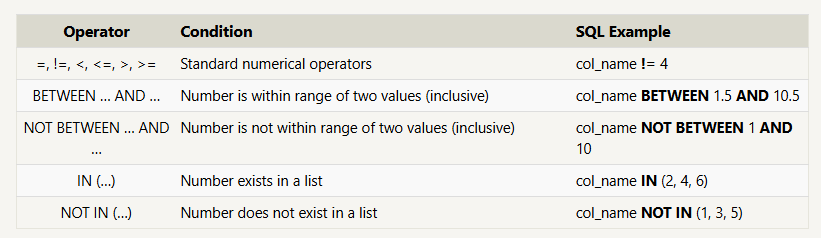
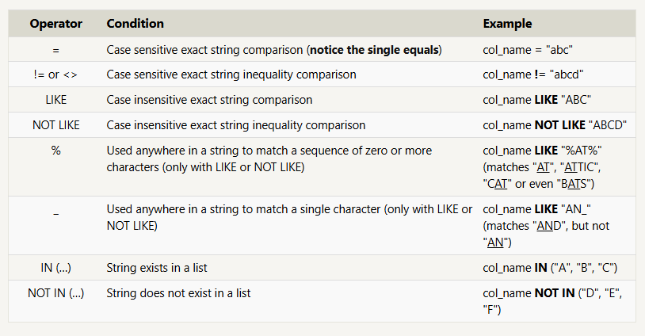
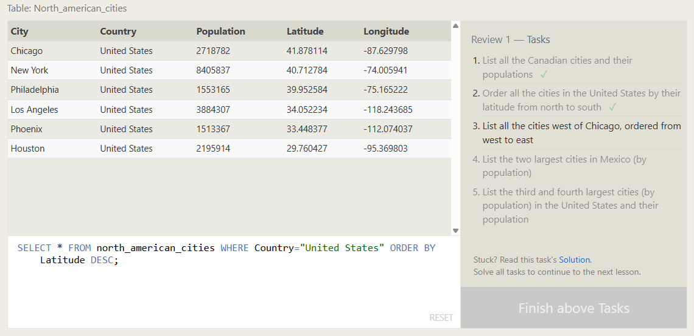
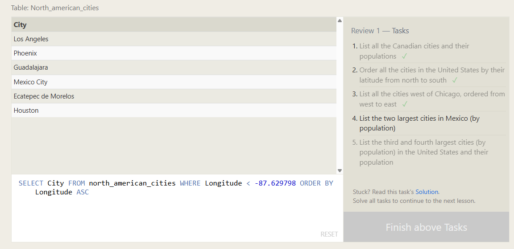
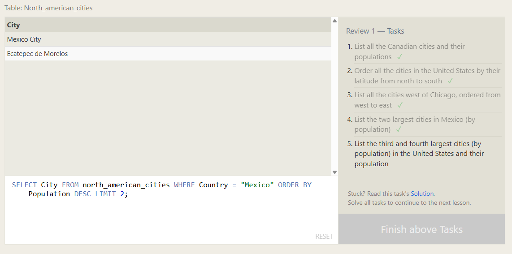
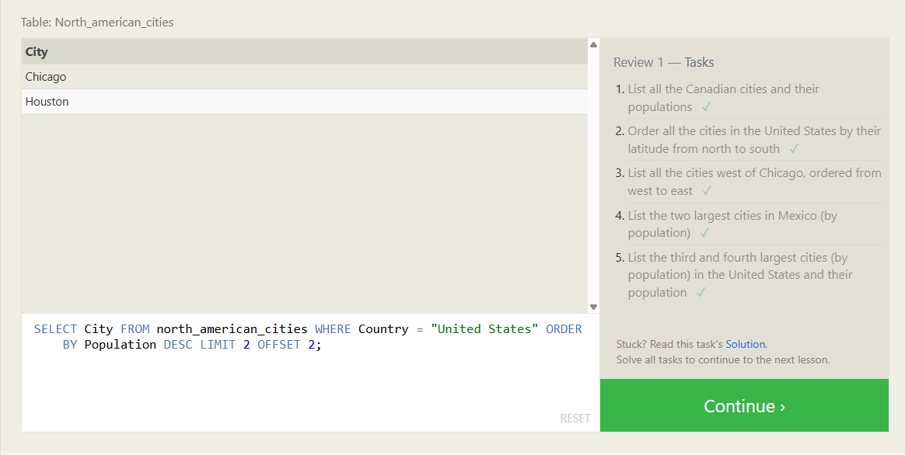

# SQL Lessons: Queries with Constraints & Filtering

## SQL Lesson 2: Queries with constraints Pt.1

### Select query with constraints
```sql
SELECT column, another_column, …
FROM mytable
WHERE condition
    AND/OR another_condition
    AND/OR …;
```
    


## SQL Lesson 3: Queries with constraints Pt.2


## SQL Lesson 4: Filtering and sorting queries
### DISTINCT keyword: 
It is used to remove duplicate rows.

```sql 
SELECT DISTINCT column, another_column, …
FROM mytable
WHERE condition(s);
```
### ODERING RESULTS

```sql 
SELECT column, another_column, …
FROM mytable
WHERE condition(s)
ORDER BY column ASC/DESC;
```

### LIMITING RESULTS TO A SUBSET

#### LIMIT: Show a reduce number of rows.

#### OFFSET: Determine the starting row to show the data.

```sql
SELECT column, another_column, …
FROM mytable
WHERE condition(s)
ORDER BY column ASC/DESC
LIMIT num_limit OFFSET num_offset;
```

## Exercises







