# Analytic Functions: Databases for Developers
## Partition By
Get the number of rows and total weight for each colour.

```sql
select colour, count(*), sum(weight) from bricks group by colour;
```
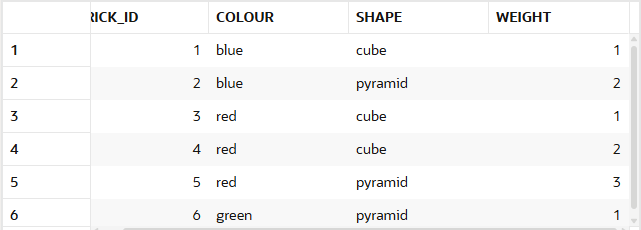
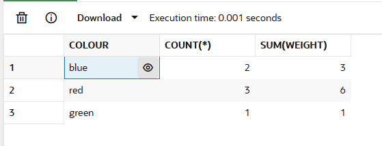

Returns the total weight and number of rows of each colour. It includes all the rows.
```sql
select b.*,
       count(*) over (
         partition by colour
       ) bricks_per_colour,
       sum ( weight ) over (
         partition by colour
       ) weight_per_colour
from   bricks b;
```
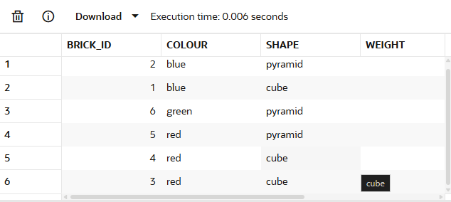
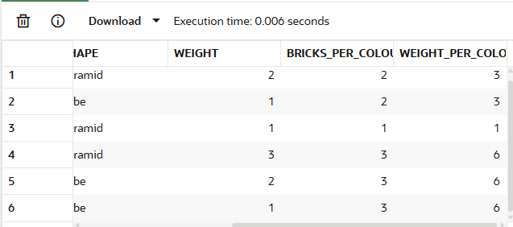

## Order By
The following sorts the rows by brick_id. Then shows the total number of rows and sum of the weights for rows with a brick_id less than or equal to that of the current row.

```sql
select b.*,
       count(*) over (
         order by brick_id
       ) running_total,
       sum ( weight ) over (
         order by brick_id
       ) running_weight
from   bricks b;
```
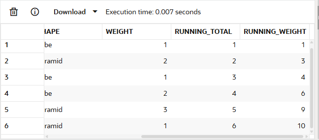

## Partition + Order By
 The following splits the rows by colour. It then gets the running count and weight of rows for each colour, sorted by brick_id:

```sql
select b.*,
       count(*) over (
         partition by colour
         order by brick_id
       ) running_total,
       sum ( weight ) over (
         partition by colour
         order by brick_id
       ) running_weight
from   bricks b;
```
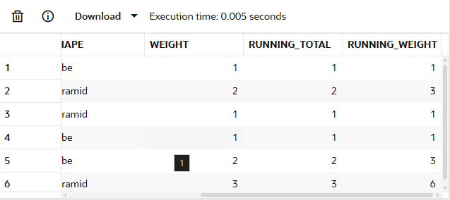

## Windowing Clause
```
range between unbounded preceding 
      and current row
```      

This means:

Include all the rows with a value less than or equal to that of the current row.

This can lead to the function including values from rows after the current!

All rows with the same weight have the same running count and weight:

```sql
select b.*,
       count(*) over (
         order by weight
       ) running_total,
       sum ( weight ) over (
         order by weight
       ) running_weight
from   bricks b
order  by weight;
``` 
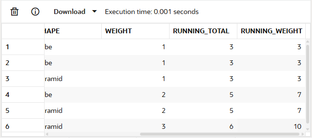

``` 
rows between unbounded preceding 
     and current row
``` 
```sql
select b.*,
       count(*) over (
         order by weight
         rows between unbounded preceding and current row
       ) running_total,
       sum ( weight ) over (
         order by weight
         rows between unbounded preceding and current row
       ) running_weight
from   bricks b
order  by weight;
``` 
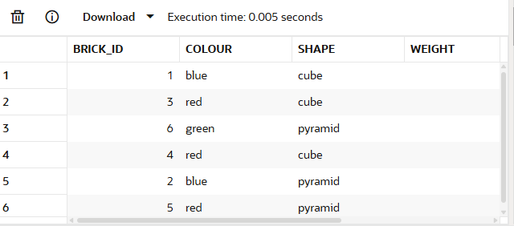
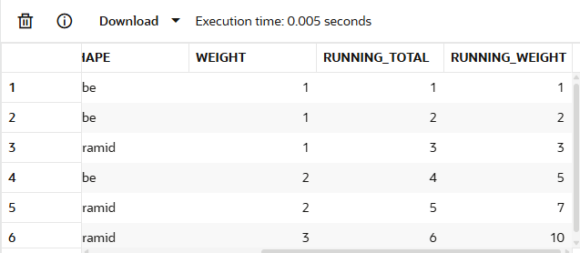
This makes the results non-deterministic. Rows of the same weight could have their running totals in a different order each time we run the query.

FIX: Add columns to the order by until each set of values in the sort appears once in your results. This makes your results deterministic. 

```sql
select b.*,
       count(*) over (
         order by weight, brick_id
         rows between unbounded preceding and current row
       ) running_total,
       sum ( weight ) over (
         order by weight, brick_id
         rows between unbounded preceding and current row
       ) running_weight
from   bricks b
order  by weight, brick_id;
```

## Sliding Windows
- The current row + the previous row.
- All rows with the same weight as the current + all rows with a weight one less than the current
```sql
select b.*,
       sum ( weight ) over (
         order by weight
         rows between 1 preceding and current row
       ) running_row_weight,
       sum ( weight ) over (
         order by weight
         range between 1 preceding and current row
       ) running_value_weight
from   bricks b
order  by weight, brick_id;
```
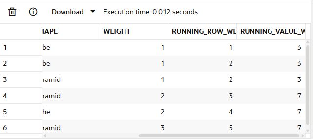

The first shows the number of rows with a weight one or two less than the current. The second counts those with weights greater than the current. So if the current weight = 2, the first count includes rows with the weight 0 or 1. The second rows with weight 3 or 4

```sql
select b.*,
       count (*) over (
         order by weight
         range between 2 preceding and 1 preceding
       ) count_weight_2_lower_than_current,
       count (*) over (
         order by weight
         range between 1 following and 2 following
       ) count_weight_2_greater_than_current
from   bricks b
order  by weight;
```

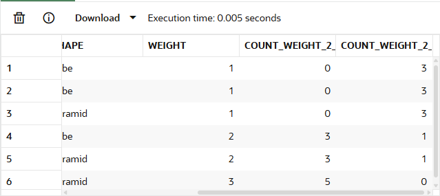

## Filtering Analytic Functions

```sql
select * from (
  select b.*,
         count (*) over ( partition by colour ) colour_count
  from   bricks b
)
where  colour_count >= 2;
```
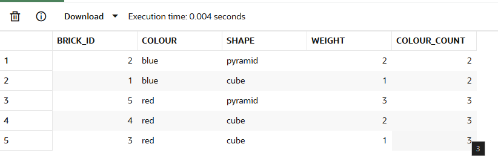