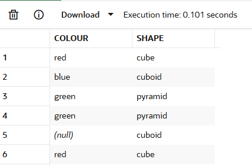
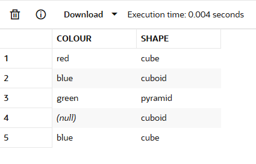
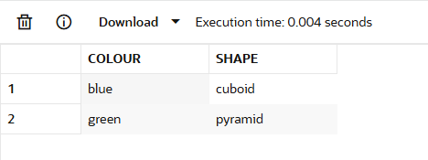
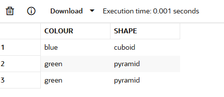
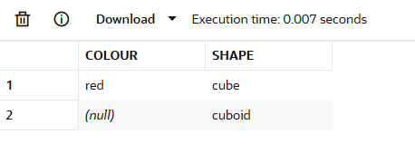
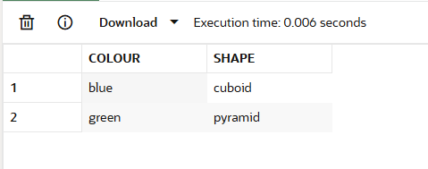
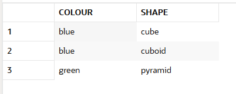
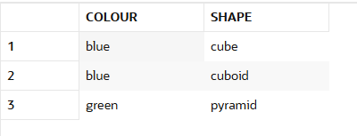
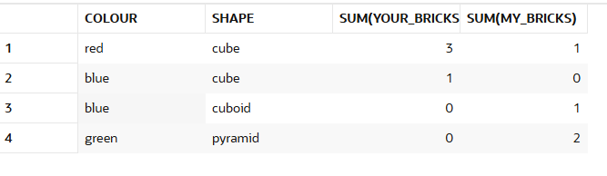
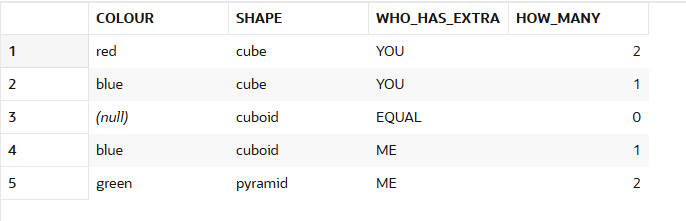

# SET OPERATORS

## UNION
It combines two or more tables into a single result set. The tables must have the same number of columns with matching data types in each position.
```sql
select colour, shape from my_brick_collection
union
select colour, shape from your_brick_collection;
```
## DISTINCT
```sql
select distinct * from my_brick_collection;
```
Example:
Get one row for each shape in your collection, select "distinct shape"

```sql
select distinct shape from your_brick_collection;
```

## UNION ALL
Combine tables including duplicates

```sql
select colour, shape from my_brick_collection
union all
select colour, shape from your_brick_collection;
```


Standard union
```sql 
select distinct * from (
  select colour, shape from my_brick_collection
  union all
  select colour, shape from your_brick_collection
);
```


## SET DIFFERENCE

It returns all the rows in one table not in another.

```sql
select colour, shape from your_brick_collection ybc
where  not exists (
  select null from my_brick_collection mbc
  where  ( ybc.colour = mbc.colour or
    ( ybc.colour is null and mbc.colour is null )
  )
  and    ( ybc.shape = mbc.shape or
    ( ybc.shape is null and mbc.shape is null )
  )
);
```
Test if the columns are equal or both are null.

## MINUS
Select the relevant columns from each table with minus between them. 

Minus applies a distinct to the output.

```sql
select colour, shape from my_brick_collection
minus
select colour, shape from your_brick_collection
```


Return both duplicated values of both tables:
```sql
select colour, shape from my_brick_collection mbc
where  not exists (
  select null from your_brick_collection ybc
  where  ( ybc.colour = mbc.colour or ( ybc.colour is null and mbc.colour is null ) )
  and    ybc.shape = mbc.shape
);
```


## FINDING COMMON VALUES
```sql
select colour, shape from your_brick_collection ybc
where  exists (
  select null from my_brick_collection mbc
  where  ( ybc.colour = mbc.colour or ( ybc.colour is null and mbc.colour is null ) )
  and    ybc.shape = mbc.shape
);
```


## INTERSECT
```sql
select colour, shape from your_brick_collection
intersect
select colour, shape from my_brick_collection;
```
The database considers null values to be the same and applies a distinct operator to the results.

## FINDING THE DIFFERENCE BETWEEN TWO TABLES (SYMMETRIC DIFFERENCE)

Comparing two tables, returning a list of all the values that only exist in one table.

This is also known as the symmetric difference. There isn't a native operator that does this. But you can do it by:

- Finding the rows in table one not in table two with minus
- Finding the rows in table two not in table one with minus
- Combining the output of these two operations with union (all).

```sql
select colour, shape from your_brick_collection
minus
select colour, shape from my_brick_collection
union all
select colour, shape from my_brick_collection
minus
select colour, shape from your_brick_collection;
```


To do the minuses before union, you need parentheses. Place them around the operations that should happen first:

```sql
select * from (
  select colour, shape from your_brick_collection
  minus
  select colour, shape from my_brick_collection
) union all (
  select colour, shape from my_brick_collection
  minus
  select colour, shape from your_brick_collection
);
```


- Combine all the rows from the two tables with union (all)
- Find the values that exist in both tables with intersect
- Minus the second query from the first
```sql
select * from (
  select colour, shape from your_brick_collection
  union all
  select colour, shape from my_brick_collection
) minus (
  select colour, shape from my_brick_collection
  intersect
  select colour, shape from your_brick_collection
);
```



## SYMMETRIC DIFFERENCE WITH GROUP BY

Read all the rows from both tables twice. Secondly minus and intersect return distinct values. So you only see the values only in one table. Not all the rows.

Check whether each table has the same number of rows for each set of values.

You can do this by union alling the two tables together with a couple of extra columns. One to count the rows from the first table, the other for the second. By returning the values 1 or 0 you can sum these up to get the count.

To see the different rows, return those where these sums are not equal in the having clause.

```sql
select colour, shape, sum ( your_bricks ), sum ( my_bricks )
from (
  select colour, shape, 1 your_bricks, 0 my_bricks
  from   your_brick_collection
  union all
  select colour, shape, 0 your_bricks, 1 my_bricks
  from   my_brick_collection
)
group  by colour, shape
having sum ( your_bricks ) <> sum ( my_bricks );
```


Using this method you only read the rows in each table once.
see which table has more rows. You can do this by comparing the sum of bricks for each colour and shape. Then return the name of the table that has more. You can also get the number of extra rows. Do this by finding the absolute value of the difference between these two sums.

```sql
select colour, shape,
       case
         when sum ( your_bricks ) < sum ( my_bricks ) then 'ME'
         when sum ( your_bricks ) > sum ( my_bricks ) then 'YOU'
         else 'EQUAL'
       end who_has_extra,
       abs ( sum ( your_bricks ) - sum ( my_bricks ) ) how_many
from (
  select colour, shape, 1 your_bricks, 0 my_bricks
  from   your_brick_collection
  union all
  select colour, shape, 0 your_bricks, 1 my_bricks
  from   my_brick_collection
)
group  by colour, shape;
```



