## Exercise 1:
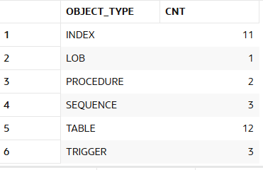
## Exercise 2: Get DDL
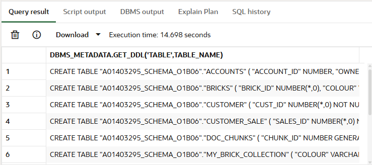
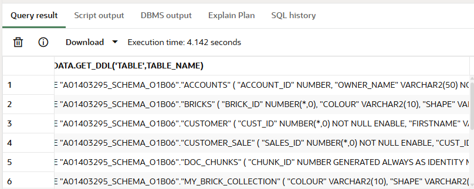
## Exercise 3: Clean DDL for portability
With schema:
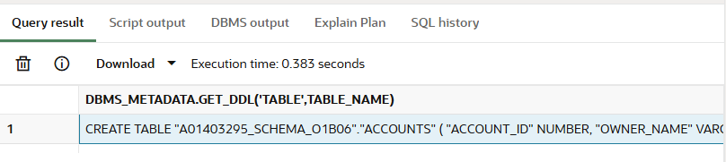
Without schema:
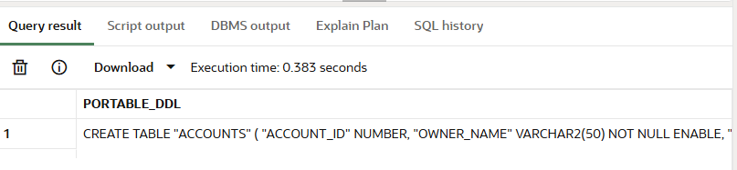
## Exercise 4: Migration
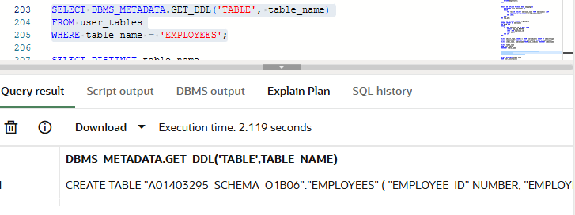
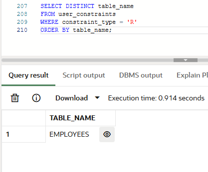
1. Find all FK
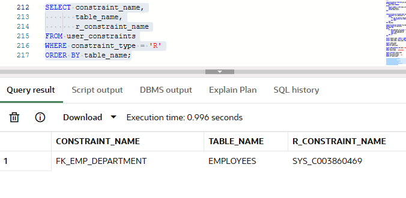
2. Find which table that referenced constraint belongs to
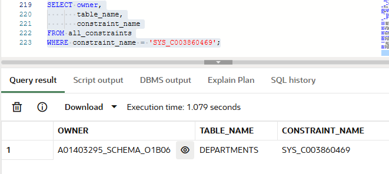
3. Extract the actual FK DDL
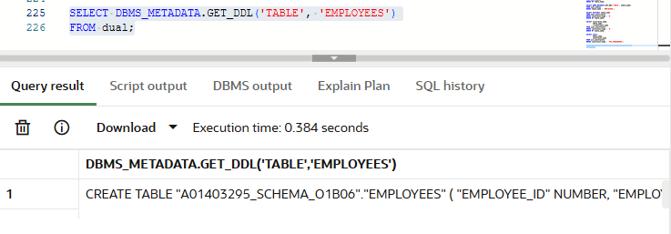
## Exercise 5:
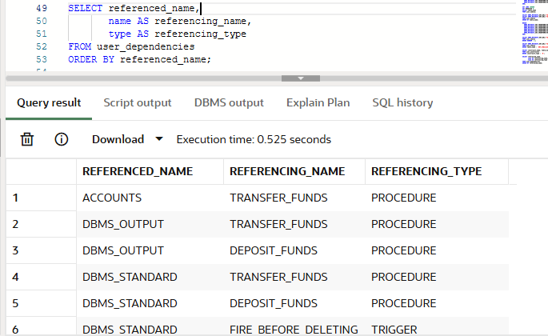
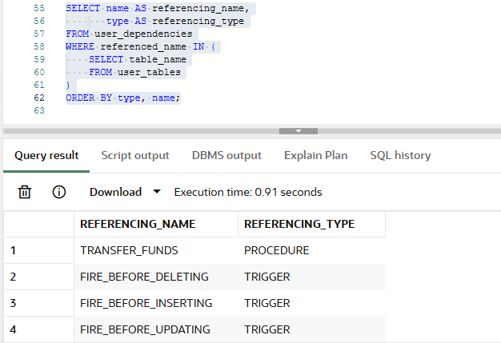
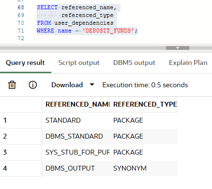
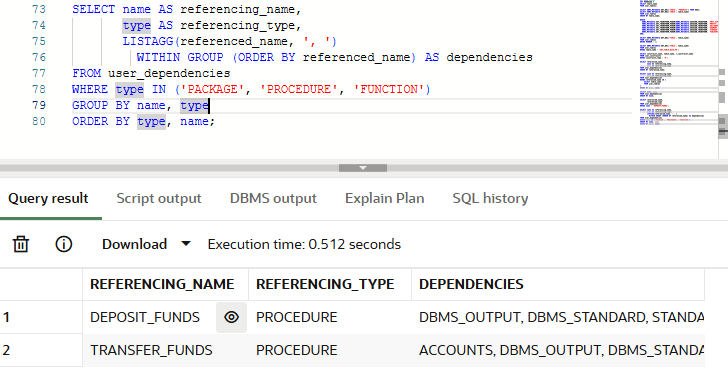
## Exercise 6:
### Step 1: Document the current schema structure
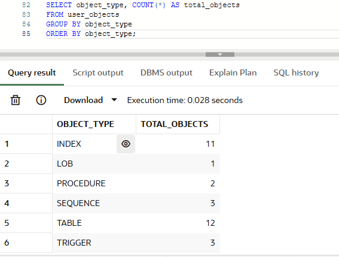
### Step 2: Extract all DDL 
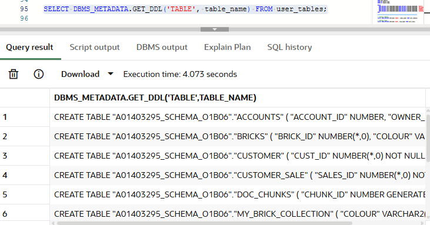
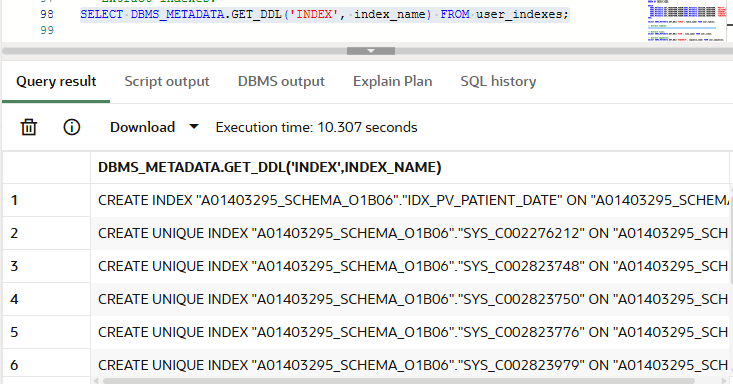
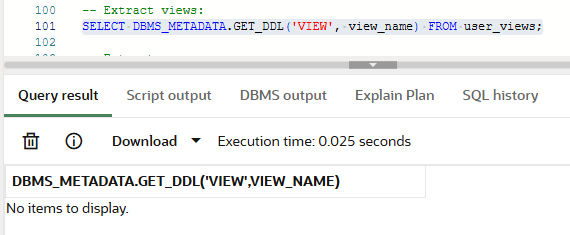
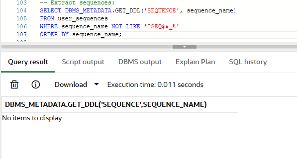
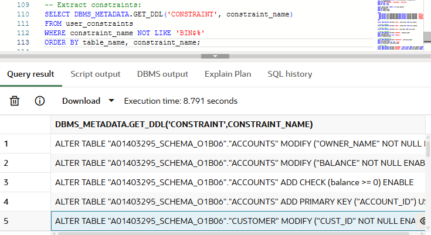
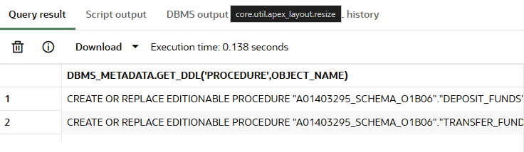
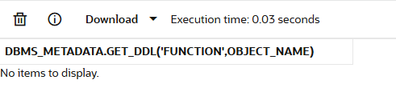
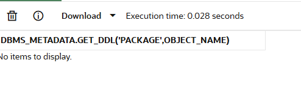
### Step 4: Verify everything transferred
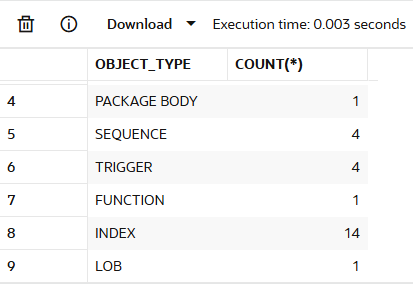
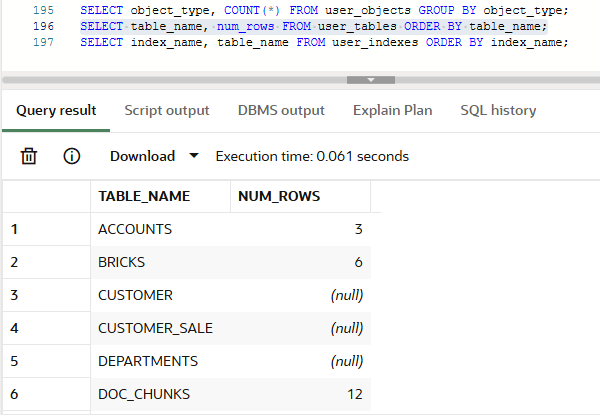
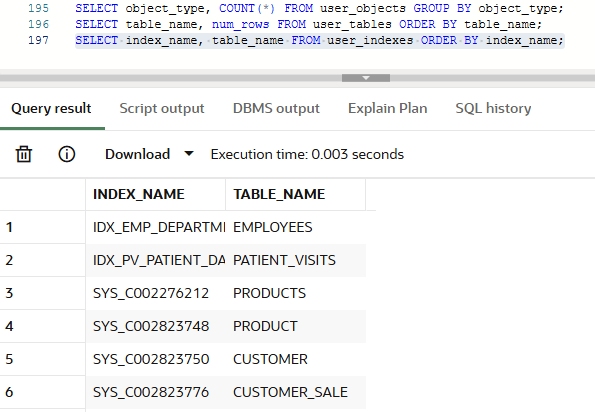

## Discussion Questions
**Q1: What are the limitations of DBMS_METADATA vs expdp?**
DBMS_METADATA only export schema structure (DDL), not actual table data, so it requires more manual work and is less practical for large migrations. It is useful when you only have SQL access and no DBA privileges.

expdp (Data Pump) is more powerful because it exports both structure and data, works faster for large schemas, and automates much of the migration process, but it requires directory privileges and higher-level Oracle access.

**Q2: If you have circular dependencies, how would you handle the reload?**
For circular dependencies, the best strategy is to create the main objects first, then apply constraints like foreign keys afterward. This avoids dependency conflicts during creation.

For PL/SQL packages, create the package specification first and the package body second. Oracle's dependency tools help determine the safest creation order.

**Q3: Your company is migrating from one Oracle database to another.
They give you read-only access to the old database and want you to recreate the schema on the new database. What's your plan?**

First, document the source schema using USER_OBJECTS, USER_TABLES, and USER_DEPENDENCIES. Then extract clean DDL using DBMS_METADATA with EMIT_SCHEMA = FALSE, review dependencies, and remove unnecessary storage/schema references.

Next, recreate objects in the proper order (tables, constraints, indexes, views, code), verify object counts, and if possible migfrate data separately using INSERT scripts or CSV exports.

