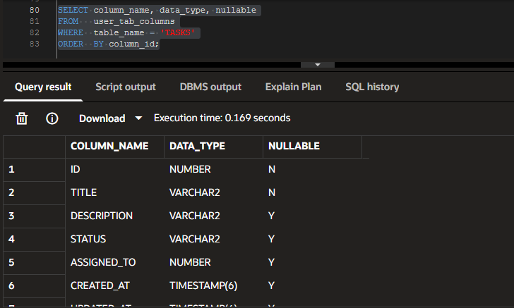
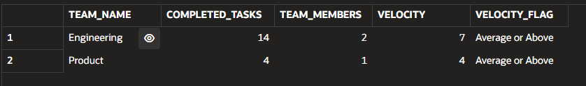
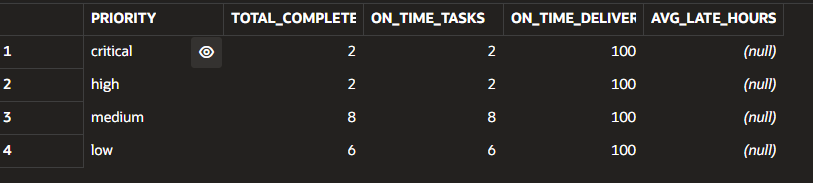
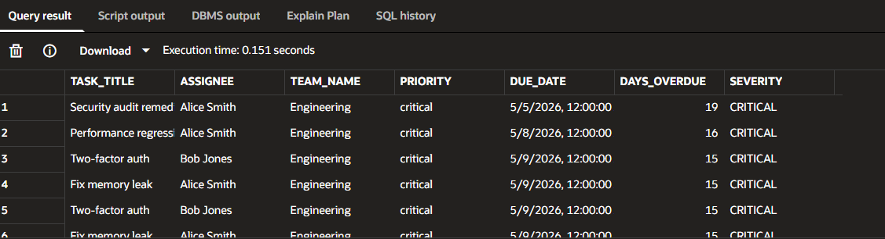
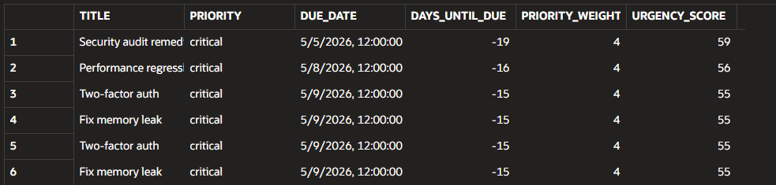
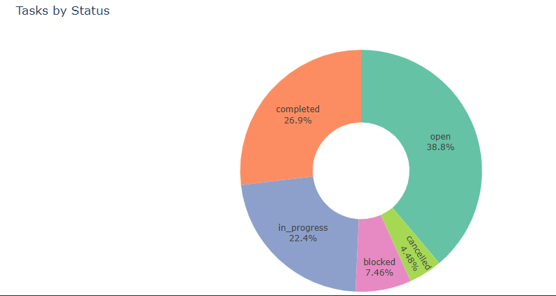
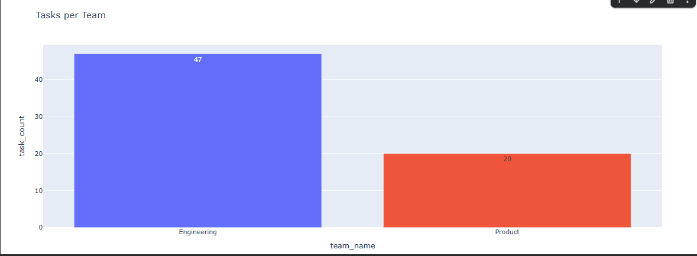
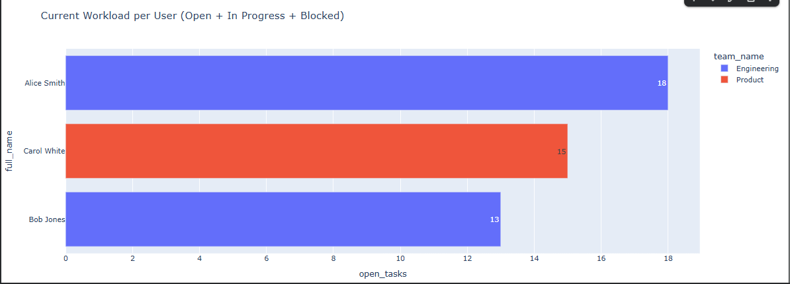
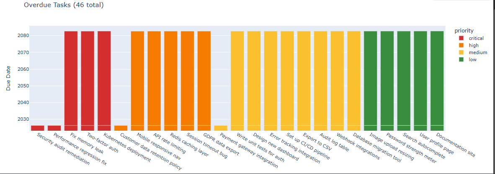
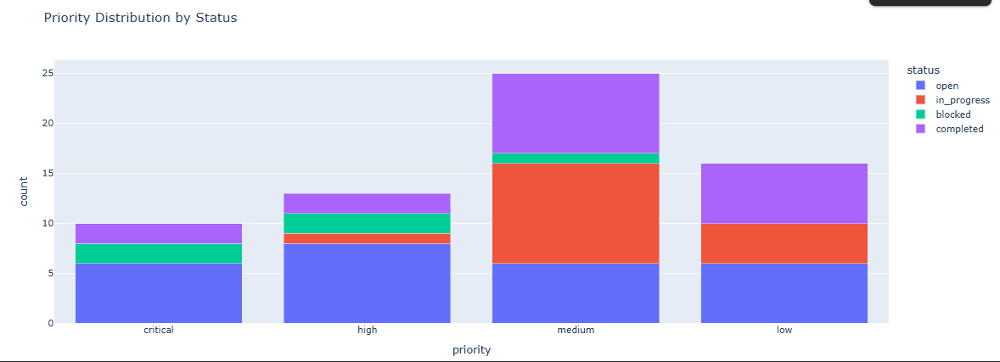

## PART A: The KPI Contract
### Exercise 1: Define "Team velocity"
1. What is the business question?
Which teams complete work faster compared to other teams?

2. What is the exact definition? (Include every filter, every join)
Team velocity is defined as: "The number of completed tasks per team member."
Formula:completed_tasks / number_of_team_members

 Assumptions:
  - Only tasks with status = 'Completed' are counted.
  - Each employee belongs to one team.
  - Tasks are assigned to employees.
  - Teams with more employees should not automatically appear faster, therefore the metric is normalized by team size.

3. What are the edge cases? (NULLs, cancelled tasks, unassigned tasks, etc.)
 - Tasks with NULL status are ignored.
 - Unassigned tasks are excluded because no team owns them.
 - Teams with zero employees must avoid division by zero.
 - Cancelled tasks are excluded because they were not completed.

4. What is the unit? (Count, percentage, hours, dollars?)
Tasks completed per employee.

5. What would make this metric misleading?
- Some tasks may be much harder than others.
- A team doing fewer but more complex tasks may appear slow.
- Teams with support or administrative work may naturally complete fewer tasks.
- Without story points or effort estimation, task count alone does not measure true productivity.

Velocity should be normalized per team member because teams
may have different sizes. For example, Engineering may have
20 people while Product has only 5.

Pros:
- Creates fairer comparisons between large and small teams.
- Measures productivity relative to team size.
- Prevents large teams from appearing automatically "better"
simply because they have more employees.

Cons:
- Does not account for task complexity.
- Small teams may appear highly productive if they complete
many simple tasks.
- Teams working on difficult or long-term projects may appear slower.
- Individual productivity differences are hidden inside the team average.

### Exercise 2: Define "On-Time Delivery Rate"
1. What is the business question?
How often are tasks completed before their deadlines?

2. What is the exact definition? (Include every filter, every join)
On-Time delivery rate is defined as: "The percentage of completed tasks finished on or before due date."
Formula: (on-time completed tasks / total completed tasks with due dates) * 100

Rules:
- Only tasks with status = 'completed' are included.
- Tasks without a due_date are excluded because they cannot be evaluated for timeliness.
- A task is considered "on time" if completed_at <= due_date.
- Tasks completed after due_date are considered late.

3. What are the edge cases? (NULLs, cancelled tasks, unassigned tasks, etc.)
- Tasks completed at 23:59 on due_date are considered on time.
- Tasks completed at 00:01 the next day are considered late.
- Tasks with NULL completed_at are excluded.
- Tasks without due_date are excluded.
- Cancelled or open tasks are excluded.

4. What is the unit? (Count, percentage, hours, dollars?)
Percentage (%) and average lateness in hours.

5. What would make this metric misleading?
- Some deadlines may be unrealistic.
- High-priority tasks may intentionally be delayed due to time complexity.
- Small delays (minutes) count the same as large delays in the on-time percentage.
- Teams may prioritize speed over quality to improve KPI.

## PART B: Improve the Class KPIs
### Exercise 3:  Improve "Tasks per Team" (KPI 2 from class)
1. What is the business question?
Which teams currently have the hightest workload and how efficiently are they completing tasks?

2. What is the exact definition? (Include every filter, every join)
total_tasks: Counts every task assigned to users in the team, regardless of status.

active_tasks:
Counts only tasks currently being worked on:
- open
- in_progress
- blocked

completion_rate:
Percentage of completed tasks out of all non-cancelled tasks.
Formula:completed tasks / (total tasks excluding cancelled) * 100

3. What are the edge cases? (NULLs, cancelled tasks, unassigned tasks, etc.)
- Teams with zero tasks should still appear.
- Cancelled tasks are excluded from completion rate.
- Division by zero must be avoided.
- Tasks without assigned are excluded because they don't belong to a team.

4. What is the unit? (Count, percentage, hours, dollars?)
- total_tasks = count
- active_tasks = count
- completion_rate = percentage

5. What would make this metric misleading?
- High task counts do not necessarily mean high workload.
- Some tasks are more complex than others.
- Teams with many small tasks may appear overloaded.
- Completion rate ignores task difficulty and quality.

### Exercise 4: Improve "Average Resolution Time" (KPI 5 from class)
1. What is the business question?
 How quickly are tasks resolved depending on their priority?

2. What is the exact definition? (Include every filter, every join)
Resolution time measures the number of hours between: created_at -> completed_at

The KPI is grouped by priority:
- critical
- high
- medium
- low

Only completed tasks are included

3. What are the edge cases? (NULLs, cancelled tasks, unassigned tasks, etc.)
- Tasks without completed_at are excluded. 
- Priorities with only 1 task may produce misleading averages.
- Extremely long tasks can distort the average.
- Median helps reduce the effect of outliers.

4. What is the unit? (Count, percentage, hours, dollars?)
Hours

5. What would make this metric misleading?
- Complex tasks naturally take longer.
- Small sample sizes are unreliable.
- Average values may hide outliers.
- Different priorities have different expectations.

### Exercise 5: Improve "Overdue Tasks"
1. What is the business question?
Which overdue tasks represent the biggest operational risk?

2. What is the exact definition? (Include every filter, every join)
A task is overdue when:
- due_date < TRUNC(SYSDATE)
- status is NOT completed or cancelled

The report includes:
- task title
- assignee
- team
- priority
- due date
- days overdue
- severity classification

Rules:
- CRITICAL:
    priority = 'critical'
    AND days_overdue > 0

- HIGH:
    priority = 'high'
    AND days_overdue > 2

- MEDIUM:
    priority = 'medium'
    AND days_overdue > 5

- LOW:
    all other overdue tasks

3. What are the edge cases? (NULLs, cancelled tasks, unassigned tasks, etc.)
- Tasks due today are NOT overdue.
- NULL due dates are excluded.
- Completed/cancelled tasks are excluded.
- Very old low-priority tasks may still be important.

4. What is the unit? (Count, percentage, hours, dollars?)
Days overdue.

5. What would make this metric misleading?
- Priority may not reflect actual business impact.
- Some teams intentionally delay low-priority work.
- Days overdue does not measure task complexity.

## PART C: The "Bad KPI" challenge
### Exercise 6: Fix the "Productivity Score"
1. What is the business question?
  Which users consistently complete meaningful work efficiently over time?

2. What is the exact definition? (Include every filter, every join)
Productivity is defined as: "Weighted completed task points per active work day."

Rules:
- Only tasks with status = 'completed' are included.
- Tasks must have completed_at NOT NULL.
- Tasks are weighted by priority:
  critical = 4 points
  high = 3 points
  medium   = 2 points
  low      = 1 point

Formula:
total weighted points / active work days

Active work days are calculated as: MAX(completed_at) - MIN(completed_at) + 1

Joins:
- users u
- LEFT JOIN tasks ts
ON ts.assigned_to = u.id

3. What are the edge cases? (NULLs, cancelled tasks, unassigned tasks, etc.)
 - Users with no completed tasks are excluded.
 - Tasks with NULL completed_at are excluded.
 - Unassigned tasks are ignored because ownership is unknown.
 - A user with only one completed task may have an inflated score.
 - Complex tasks may still take much longer than simple tasks, even within the same priority level.

4. What is the unit? (Count, percentage, hours, dollars?)
Weighted productivity points per day.

5. What would make this metric misleading?
- Priority is only an approximation of complexity.
- Quality of work is not measured.
- Some users may receive fewer but harder tasks.
- Collaboration and team support work are not captured.
- Short active periods can artificially inflate productivity.

### Exercise 7: Fix the "Team Efficiency"
1. What is the business question?
 Which teams complete the highest proportion of their work?

2. What is the exact definition? (Include every filter, every join)
Team efficiency is defined as completed tasks / total non-cancelled tasks * 100

Rules:
- Only tasks assigned to team members are included.
- Cancelled tasks are excluded from the denominator.
- Completed tasks are counted in the numerator.

Tables:
- teams t
- users u
- tasks ts

Joins:
teams -> users -> tasks

3. What are the edge cases? (NULLs, cancelled tasks, unassigned tasks, etc.)
- Teams with zero tasks should still appear.
- Teams with only cancelled tasks may cause division by zero.
- Unassigned tasks are excluded.
- Some teams may intentionally leave tasks open longer because of task complexity.

4. What is the unit? (Count, percentage, hours, dollars?)
Percentage (%)

5. What would make this metric misleading?
- Task complexity is not measured.
- Small tasks and large projects count equally.
- Teams handling urgent production issues may appear less efficient.
- Quality of completed work is not included.

### Exercise 8: Fix the "Urgency Index"
1. What is the business question?
 Which tasks require immediate attention?

2. What is the exact definition? (Include every filter, every join)
Urgency score is calculated using priority weight + overdue impact

Priority weights:
critical = 4
high = 3
medium = 2
low = 1

days_until_due: due_date - today

- Overdue tasks receive higher urgency scores.
- Only non-completed and non-cancelled tasks are included.

3. What are the edge cases? (NULLs, cancelled tasks, unassigned tasks, etc.)
- Tasks without due_date are excluded.
- Overdue tasks produce negative days_until_due.
- Very old overdue low-priority tasks may rank highly.
- Tasks due today require careful interpretation.

4. What is the unit? (Count, percentage, hours, dollars?)
Numeric urgency score.

5. What would make this metric misleading?
- Priority may not reflect real business impact.
- Some tasks are intentionally delayed.
- Complexity and dependencies are not measured.

## Graphics
### KPI 1 — Tasks by Status

### KPI 2 — Tasks per Team

### KPI 3 — Workload per User

### KPI 4 & 5 — Completion Rate + Avg Resolution

### KPI 6 — Tasks Created per Day 

### KPI 7 — Overdue Tasks

### KPI 8 — Priority Distribution 

### Tasks completed per day

### Full Dashboard

